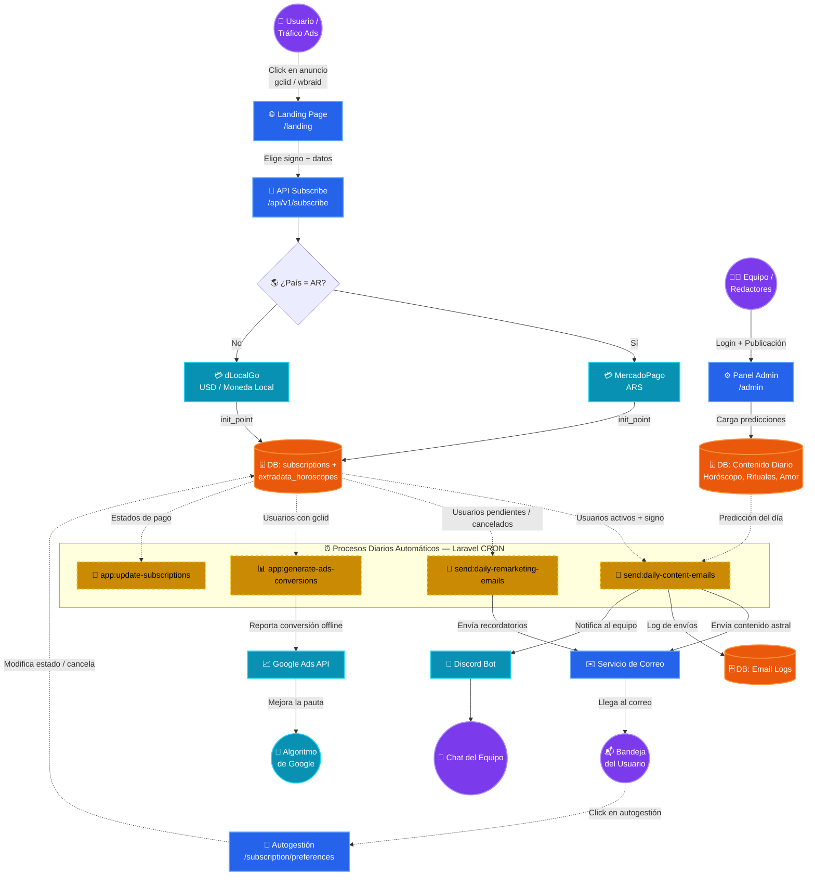

# 🔮 MiHoroscopo.com.ar

**Plataforma SaaS de suscripción a contenido astrológico diario con distribución automatizada por email, integración de pagos multi-país y optimización de campañas publicitarias.**

---

## 📐 Diagrama de Arquitectura

> 📄 **Archivo editable:** [`docs/architecture.mmd`](docs/architecture.mmd) — Abrilo con cualquier editor Mermaid ([mermaid.live](https://mermaid.live), VS Code con extensión Mermaid, etc.)

---

## 🧭 Flujo General del Sistema



---

## 🏗️ Stack Tecnológico

| Capa | Tecnología |
|---|---|
| **Framework** | Laravel 10 (PHP 8.x) |
| **Base de Datos** | MySQL |
| **Pagos AR** | MercadoPago API |
| **Pagos LATAM/Global** | dLocalGo |
| **GeoIP** | MaxMind GeoLite2 (`.mmdb`) |
| **Email** | Laravel Mail (SMTP) |
| **Notificaciones** | Discord Webhooks |
| **Ads Tracking** | Google Ads Conversion API |
| **Frontend** | Blade Templates + Vite |

---

## 📂 Estructura del Proyecto

```
mihoroscopo.com.ar/
├── app/
│   ├── Console/
│   │   ├── Kernel.php                    # Scheduler (4 cron jobs diarios)
│   │   └── Commands/
│   │       ├── SendDailyContentEmails.php    # Envío masivo de horóscopo
│   │       ├── SendDailyRemarketingEmails.php # Remarketing a inactivos
│   │       ├── UpdateSubscriptions.php       # Sincroniza estados de pago
│   │       └── GenerateConversions.php       # Reporta a Google Ads
│   ├── Http/Controllers/
│   │   ├── LandingController.php         # Landing + detección GeoIP
│   │   ├── HomeController.php            # Página principal
│   │   ├── SubscriptionController.php    # CRUD de suscripciones + checkout
│   │   ├── ArticleController.php         # Blog y artículos SEO
│   │   ├── AdminController.php           # Panel de administración
│   │   ├── NotificationController.php    # Cola de notificaciones
│   │   └── EmailTrackingController.php   # Pixel de apertura de emails
│   ├── Models/
│   │   ├── Subscription.php              # Suscripción del usuario
│   │   ├── ExtradataHoroscope.php        # Datos extra (signo, tracking)
│   │   ├── ContentHoroscope.php          # Predicciones diarias
│   │   ├── ContentAstralGuide.php        # Guía astral
│   │   ├── ContentLovePrediction.php     # Predicción amorosa
│   │   ├── ContentLoveRitual.php         # Rituales de amor
│   │   ├── ContentLunarRitual.php        # Rituales lunares
│   │   ├── ContentProsperityRitual.php   # Rituales de prosperidad
│   │   ├── ContentZodiacCompatibility.php # Compatibilidad zodiacal
│   │   ├── EmailLog.php                  # Registro de emails enviados
│   │   ├── Article.php                   # Artículos del blog
│   │   └── Payment.php                   # Registro de pagos
│   ├── Services/
│   │   ├── MercadoPagoService.php        # Integración MercadoPago
│   │   ├── DlocalGoService.php           # Integración dLocalGo
│   │   ├── DiscordService.php            # Alertas al equipo
│   │   ├── GoogleAdsConversionService.php # Conversiones Google Ads
│   │   └── EmailService.php              # Envío de emails
│   └── Mail/
│       └── DailyContentEmail.php         # Mailable del contenido diario
├── routes/
│   ├── web.php                           # Rutas web (landing, admin, blog)
│   ├── api.php                           # API REST (subscribe, notifications)
│   └── console.php                       # Comandos Artisan
├── resources/views/
│   └── mihoroscopo/                      # Vistas Blade del frontend
├── database/migrations/                  # Migraciones de BD
├── public/                               # Assets públicos
└── config/                               # Configuración de Laravel
```

---

## 🔄 Ciclo de Vida Completo

### 1️⃣ Adquisición
El usuario llega desde **Google Ads**, **LinkedIn Ads** o tráfico directo. El sistema:
- Detecta el país vía **GeoLite2** (IP → ISO code)
- Captura parámetros de tracking (`gclid`, `gbraid`, `wbraid`, `li_fat_id`, `click_id`, `spot_id`)
- Soporta **A/B testing** de landings mediante el parámetro `?v=`

### 2️⃣ Suscripción y Pago
- **Argentina (AR):** MercadoPago en ARS (Pesos Argentinos)
- **Resto de LATAM:** dLocalGo en moneda local (COP, MXN, BRL, CLP, PEN, UYU, etc.)
- **Otros países:** dLocalGo en USD

El sistema crea la suscripción en estado `pending` y redirige al checkout externo.

### 3️⃣ Distribución de Contenido (Diaria, Automática)
Cada día a la hora programada, `send:daily-content-emails`:
1. Consulta todos los suscriptores con estado `authorized` o `pending`
2. Obtiene el **signo zodiacal** de cada uno desde `extradata_horoscopes`
3. Cruza con el **contenido del día** (8 tipos de contenido distintos)
4. Envía el email personalizado
5. Registra en `email_logs` y notifica al equipo por **Discord**

### 4️⃣ Optimización de Ads (Retroalimentación)
`app:generate-ads-conversions` reporta a **Google Ads API** las conversiones exitosas usando el `gclid` almacenado, cerrando el loop de optimización del algoritmo publicitario.

### 5️⃣ Autogestión del Usuario
Cada email incluye enlaces para:
- 📊 Ver preferencias → `/subscription/preferences/{id}`
- ⬆️ Upgradear plan → `/subscription/update/{id}`
- ❌ Cancelar → `/subscription/unsubscribe/{id}`
- 🔄 Reactivar → `/subscription/reactivate/{id}`

---

## 🌍 Países y Monedas Soportados

| País | Código | Moneda | Pasarela |
|---|---|---|---|
| 🇦🇷 Argentina | AR | ARS | MercadoPago |
| 🇧🇷 Brasil | BR | BRL | dLocalGo |
| 🇲🇽 México | MX | MXN | dLocalGo |
| 🇨🇴 Colombia | CO | COP | dLocalGo |
| 🇨🇱 Chile | CL | CLP | dLocalGo |
| 🇵🇪 Perú | PE | PEN | dLocalGo |
| 🇺🇾 Uruguay | UY | UYU | dLocalGo |
| 🇵🇾 Paraguay | PY | PYG | dLocalGo |
| 🇧🇴 Bolivia | BO | BOB | dLocalGo |
| 🇪🇨 Ecuador | EC | USD | dLocalGo |
| 🇵🇦 Panamá | PA | USD | dLocalGo |
| 🇨🇷 Costa Rica | CR | CRC | dLocalGo |
| 🇬🇹 Guatemala | GT | GTQ | dLocalGo |
| 🌐 Otros | — | USD | dLocalGo |

---

## ⚡ Comandos Artisan Principales

```bash
# Enviar emails de contenido diario a todos los suscriptores activos
php artisan send:daily-content-emails

# Enviar a un email específico (para testing)
php artisan send:daily-content-emails user@example.com

# Enviar emails de remarketing
php artisan send:daily-remarketing-emails

# Actualizar estados de suscripciones
php artisan app:update-subscriptions

# Generar conversiones para Google Ads
php artisan app:generate-ads-conversions
```

---

## 🔑 Variables de Entorno Clave

```env
# MercadoPago
MERCADOPAGO_ACCESS_TOKEN=

# dLocalGo (por país)
AR_INIT_POINT=
MX_INIT_POINT=
CO_INIT_POINT=
GLOBAL_INIT_POINT=

# GeoIP
GEOIP_DB_PATH=storage/geoip/GeoLite2-Country.mmdb

# Discord
DISCORD_WEBHOOK_URL=

# Google Ads
GOOGLE_ADS_DEVELOPER_TOKEN=
GOOGLE_ADS_CLIENT_ID=
GOOGLE_ADS_CLIENT_SECRET=

# Vistas
VIEW_DIRECTORY=mihoroscopo
```
